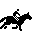

# MetaFlora Derby 

MetaFlora Derby is a tribute to the classic Horse Race v1.0 by Thomas Schulze, written for Mac in July 1986 and the notorious Sigma Derby of Lake Tahoe Casinos.

Play it in your browser at:

[https://kimmknight.github.io/HorseRacer/](https://kimmknight.github.io/HorseRacer/)

Horse Racer is written in HTML/CSS/JavaScript using Vue 3 (no build tools) and Bootstrap 5.
